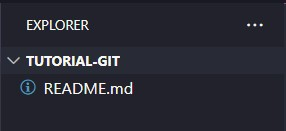
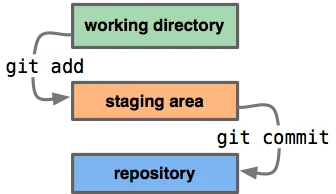
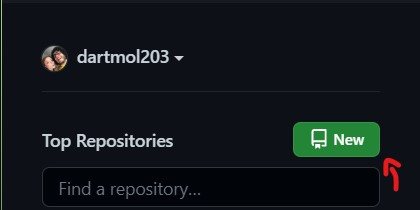
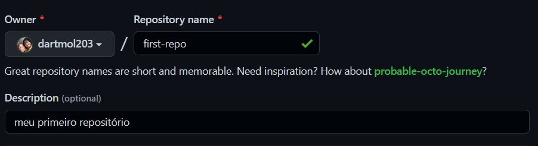
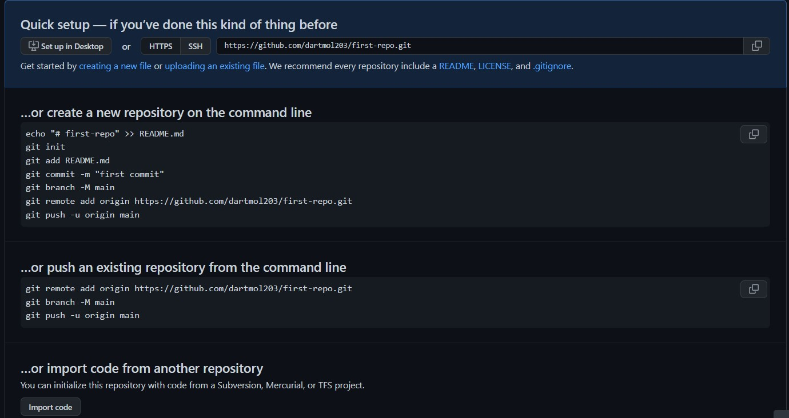

# Tutorial Git e GitHub

## Objetivos

O objetivo desse repositório é ensinar os primeiros passos, desde a configuração até o uso diário, do git, com apoio da plataforma [GitHub](https://github.com).


# O que é o Git e GitHub?

## Git

É um software de código aberto para controle de versões de arquivos, apesar de ser voltado à área de desenvolvimento de software, ele pode ser utilizado para quaisquer tipos de arquivos, por exemplo, versionamento de documentos e trabalhos de conclusão de curso.<br>


O [Git](https://git-scm.com) foi publicado originalmente em abril de 2005 e foi desenvolvido pelo mesmo desenvolvedor do linux, [Linus Torvalds](https://github.com/torvalds), atualmente é o sistema de versionamento mais utilizado por uma ampla gama de profissionais na área.

> Esse sistema possui uma série de diferenciais quando comparado a outros softwares de versionamento, caso queira saber mais, [veja aqui](https://www.atlassian.com/br/git/tutorials/what-is-git).

## GitHub

É uma plataforma de hospedagem de código fonte, amplamente utilizada por milhares de usuários diariamente, tanto para projetos pessoais ou faculdade, qunato para uso profissional e código aberto.


A empresa foi fundada em 2008, sendo posteriormente adiquirida pela Microsoft, tendo crescido tanto que em julho de 2022 tinha cerca de 83 milhões de usuários na plataforma.

# Primeiros Passos

## Conta no GitHub

Antes de tudo, já crie sua conta no [GitHub](https://github.com), ela é gratuita, mas vale a pena linkar seu email da sua instituição de ensino, você pode ganhar diversos benefícios, entre eles o GitHub PRO, que te permite ter ilimitados repositoriórios privados (sem o PRO só se pode ter 1 por conta).

---

## Instalação do Git

O Git pode ser instalado em todos os principais sistemas operacionais da atualidade, sendo presente nativamente no Mac e kernel Linux.

Antes de se instalar, verifique se o seu sistema já não possui o git instalado, para isso, abra o terminal e digite o comando:

```
$ git version
```

Caso tenha o git instalado, ele vai imprimir na tela a versão instalada no seu computador no seguite formato:

```
> git version 2.35.1.windows.2
```

Caso o Git não esteja instalado, ele mostrará o erro que o comando "git" não é conhecido. Logo, o mesmo deve ser instalado [clicando aqui](https://git-scm.com/downloads).

## Configuração do ambiente

Com o git instalado, agora deve-se configurar o usuario e e-mail para poder utilizar o mesmo.

### Definição do usuário:

Abra o terminal e digite o seguinte comando:

``` C++
$ git config --global user.name "Seu usuario" 
// substitua pelo seu nome de usuário
```

Para confirmar se o usuario foi cadastrado corretamente, execute o seginte comando, que deve retornar o seu usuário criado:

```
$ git config --global user.name

> Seu usuario
```

### Definição do Email

Abra o terminal e digite o seguinte comando:

``` C++
$ git config --global user.email "seu.email@exemplo.com" 
// substitua pelo seu email
```

Para confirmar se o email foi cadastrado corretamente, execute o seginte comando, que deve retornar o seu email cadastrado

```
$ git config --global user.email

> seu.email@exemplo.com
```

# Criando seu primeiro repositório

## O que é um repositório?

Um repositório, muitas vezes chamado de repo, é um diretório especial que possui uma sub-pasta oculta ".git/" que armazena todo o histórico do seu projeto, por isso, pense muito bem antes de mexer com ela.

## Como criar um repositório

Para criar o seu primeiro repo, é recomendado segui os seguintes passos:

1. Crie uma nova pasta no seu computador, pode ser com qualquer nome, utilizaremos "tutorial-git" durante esse guia.

2. Abra a pasta criada no seu editor de preferência, aqui usaremos o VScode.

3. Crie um arquivo "README.md", esse arquivo estará presente em praticamente todos os repositórios que você ver, ele é utilizado para passar quaisquer informações uteis sobre o repositório para os usuários e contribuidores dele.
    - A extensão ".md" do arquivo criado, se refere a liguagem de marcação "MarkDown", com marcadores faceis de se entender e utilizar, outro exemplo de linguagem de marcação é o HTML, muito usado em desenvolvimento WEB.

4. No arquivo criado, escreva a descrição do repositório, por exemplo:
    ```
    Este é o meu primeiro repositório git!
    ```
5. Não se esqueça de salvar o arquivo depois da edição!

6. Seu repositório deve estar assim:

    

7. Abra o terminal na pasta desejada
   
    - No windows, com a pasta aberta no explorador de arquivos, pode-se abrir direto na pasta desejada ao digitar "cmd" e confirmando no enredeço do diretório

8. utilize o seguinte comando para inicializar seu repo:
    ```
    $ git init
    ```
9. Caso seja bem sucedido, o comando retornará o seguinte resultado:
    ``` C++
    >  Initialized empty Git repository in {path}/tutorial-git/.git/
    ```

### Pronto, com isso, seu repositório está criado, com sua pasta /.git adicionada. Agora tá na hora de conhecer o que o git tem a oferecer.

# Como utilizar o seu repositório?

## Anatomia da área de desenvolvimento

Ao se utilizar um repositório do git, existem 3 camadas principais em que os arquivos podem transitar, sendo eles:



- Working directory, ou área de desenvolvimento, é o ambiente em que ocorre as edições ativas dos arquivos, a camada que é mais utilizada;

- Staging area, ou área de preparação, é o ambiente em que se juntam um os arquivos modificados em um grupo para enviá-los ao repositório;

- Repository, ou repositório, é a camada final em que os arquivos estão armazenados e possui o registro de todas as modificações que ocorreram desde a criação do mesmo.

## Como transitar as modificações entre as camadas?

### área de desenvolvimento -> área de preparação

- Para mover um arquivo modificado para a área de preparação, deve-se utilizar o comando "git add \<nome do arquivo>", no caso do tutorial:

    ``` 
    git add README.md
    ```

- Caso queira confirmar o resultado, deve-se executar o comando:

    ```
    git status
    ```
    Comando que retorna os status das mudanças realizadas, ele deve estar na seguinte forma:

    ``` C
    On branch master

    No commits yet

    Changes to be committed:
    (use "git rm --cached <file>..." to unstage) // comando utilizado para reverter o git add.
            new file:   README.md
    ```
### Área de preparação -> repositório

- Agora vem o comando que mais falam por ai, o "git commit", esse que move os arquivos adicionados pela etapa anterior para o repositório. Ele funciona no seguinte formato:

    ```C
    git commit -m "primeiro commit"
    // sendo esse "-m" para inserir a mensagem atrelada ao commit, nesse caso, "primeiro commit".
    ```
- Esse comando retorna o seguinte resultado:
    ```
    [master (root-commit) 2b041d1] primeiro commit
    1 file changed, 1 insertion(+)
    create mode 100644 README.md
    ```

- Por fim, recomenda-se alterar o nome da _Branch_ principal de master para main da seguinte forma:
    ```C
    git branch -M "main"
    ```

### Interfaces gráficas 
- Existem diversas interfaces graficas que auxiliam nas etapas realizadas acima, já utilizei duas delas, o GitHub Desktop e o GitKraken, ambas muito boas, no site do [git](https://git-scm.com/downloads/guis) você pode encontrar diversos softwares que fazem isso, encontre o que te agrada mais.

- Nesse tutorial, vou utilizar o GitHub na versão WEB mesmo. Vamos para essa etapa agora mesmo.

# O GitHub

## Criação do repo online

- Após estar com conta criada e logado, na barra a esquerda vai ter um botão verde de criação de novo repositório

    

- Clique nele e será redirecionado a página de criação do repositório.

- Na página de criação, de um nome para o seu repositório e uma descrição.

    

- Após isso, vá ao final da página e confirme a criação do repositório.

- Vai aparecer uma série de opções de o que fazer com esse repositório:

    

- Como já temos o repositorio criado local, vamos na segunda opção, deve-se copiar os códigos e cola-los no terminal:

    ``` C
    git remote add origin https://github.com/dartmol203/first-repo.git
    git branch -M main 
    git push -u origin main
    ```
    - A primeira linha faz uma conexão entre o seu repositório local com o repositório no GitHub;
    - A segunda linha renomeia a branch principal para "main", coisa que já fizemos anteriormente mas não traz problemas fazer novamente;
    - Já a última linha, ela envia os commits feitos, no caso apenas 1, para o repositorio conectado pela primeira linha.

<br>

- O resultado dos comando vai ser algo no seguinte formato:

    ```
    Enumerating objects: 3, done.
    Counting objects: 100% (3/3), done.
    Writing objects: 100% (3/3), 264 bytes | 264.00 KiB/s, done.
    Total 3 (delta 0), reused 0 (delta 0), pack-reused 0
    To https://github.com/dartmol203/first-repo.git
    * [new branch]      main -> main
    branch 'main' set up to track 'origin/main'.
    ```

- Após isso, podemos recarregar a página do GitHub e as nossas alterações estarão lá!!

<!-- TO-DO 


- branches

- clone /fork

- PR's


 -->
# Desafio

